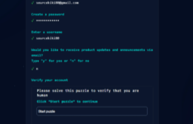

### 1. 깃허브 가입
주소 : https://github.com/

1) 상단 위의 sign up 을 눌러 회원가입

<!--
1 > 2 > 3 > 4 기입 그림추가  
공대 누나가 칠판처럼 지시봉을 가르치며 말구름으로 설명

디바이드 나누기 알아보기
-->

|||
|---|---|
||이렇게 하면 여기에 내용을 넣어거 검색이 가능하게 만들고 내용을 쓰면 해결 할 수 있는데 이 안에서 줄바꿈을 할수 있는가   이러면 줄 바꿈 가능 대신 에디터에서 보기는 조금 불편함|

 그림뒤에 글을 쓰면 뒤에 바로 붙어서 나오기는 하지만 한 줄 처럼 나온다

1) 차례대로 기입 (4번째 Y / N 는 업데이트 메일 받을지 여부이니 일단 N)  
2) start puzzle 누름 > 퍼즐 2번 선택  

### 2. 블로그 테마 복사
### 3. 블로그 포스팅

미래 날짜  
future                   : true
published: true

블로그 맨 처음
layout: post
title:  "Welcome to Jekyll!"

캡쳐 이미지 붙여넣기  
plug in : paste image  
경로 설정  
pasteImage: basePath 둘중에 하나(일단 기본 그대로)  
Paste image: path
> ../images

이미지 넣기  
> ! [Alt text] (/images/logo.png)

