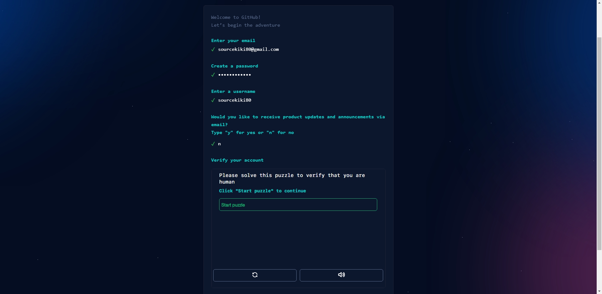

목차  
텍스트  
이미지  
표  

실시간 추가테스트

줄바꿈  
</br>


표 만들기
> |제목1|제목2|제목3|
> |---|---|---|
> |내용1|내용2|내용3|

\|제목1|제목2|제목3|  
\|---|---|---|  
\|내용1|내용2|내용3|

마크다운이 적용 안되게 하려면 앞에 \ 를 붙이면 됨

이미지 삽입  
  


이미지에 링크  
[](https://onetenthart.github.io/)

이미지 크기변경  
#마크다운 불가  
{: width="5px" height="5px"}
{: width="100%" height="100%"}


html 가능  



중앙정렬
<p align="center"></p>

<center></center>

원본이미지 링크 썸네일  
[](/images/account_2.jpg)


토글 리스트 (접기/펼치기)
<details>
<summary>여기를 눌러주세요</summary>
<div markdown="1">       

😎숨겨진 내용😎

</div>
</details>

자주사용하는 html이나 마크다운은 단축어로 지정해서 쓰면 편리함

코드블록
```
내용1
내용2
내용3
```
스페이스바 4번으로도 표현가능

    내용1
    내용2
    내용3
나갈때는 앞에 스페이스바 4번 지우고 제일앞에 내용 적으면 됨

링크  
<링크할 주소>

설명 있는 링크주소  
[링크설명](링크주소)


